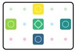

# How to Read Sky Music Sheets

The visual music sheets on this website are a bit like [tablature](./discord.html), which is a form of musical notation indicating instrument fingering rather than musical pitches.

So in the below example, you simply press where the Sky music sheet asks you to, which on the ABC1-5 reference chart is A3, B2 and C4

## What do the colours mean

They're just a way to differentiate between rows (A, B and C) to make the sheets a bit easier to read.

**However!**

If you find a section like the image below it generally means the notes are played in a fast pace one after the other, from light to dark colour.

Lastly, if you come across a blank space with a dot in the middle.

This signifies a pause in the song.

Please note that all the sheets on this website are fan-made and are the creator's own interpretation. If you already know the song and its rhythm in your head, it will help reading the music sheets here.

If you notice any errors on a sheet or require any further assistance, come and join our [Discord](./discord.html) server.

## How to print or save as PDF

If you use your web browser to print the sheet (or convert it to PDF using a a virtual printer), make sure to select the "background graphics" options in the "more settings" panel of the print window.
This options is called "Backround images" in Firefox.

## Demo
 

 We recommend <a href="https://specy.github.io/skyMusic/">https://specy.github.io/skyMusic/</a> as piano simulator to practise songs. You can even export your Visual Sheet in a format directly playable by this website, by clicking the "Download" button at the top right corner.

  
<iframe src="https://player.vimeo.com/video/358248560" width="640" height="400" frameborder="0" allow="autoplay; fullscreen" allowfullscreen></iframe>
